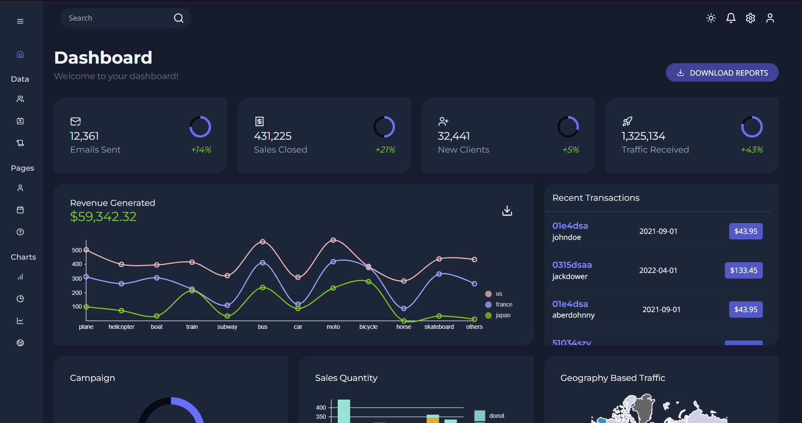

# ATHENA
Explore Athena – a React-based dashboard project that showcases a succinct overview of vital stats like new clients and revenue, along with insightful graphs such as bar, line, and pie charts. Navigate dedicated pages for in-depth data, including transaction logs, traffic maps, contact lists, team management, invoices, calendar, and a FAQ page. 

## 📝 What I've Learned
I've been studying React and the principles of componentization lately, and this project intends to put to practice this approach to development by not only incorporating multiple pages (accessible through a persistent sidebar), but also having a main page, the Dashboard, that provides a succinct overview of all the data available across the remaining pages.

## 🏅 Acknowledgments
Based on [Ed Roh's tutorial](https://www.youtube.com/watch?v=wYpCWwD1oz0). Thank you!

🔗 [See it live!](https://athena-dashboard-app.netlify.app)

## ⚙️ Tech

 
 
 
 